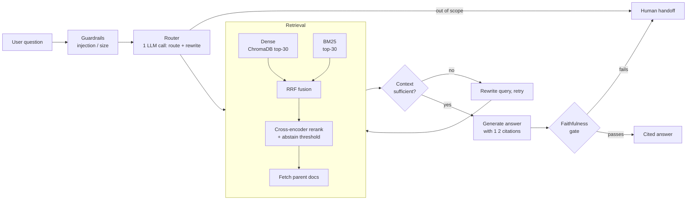
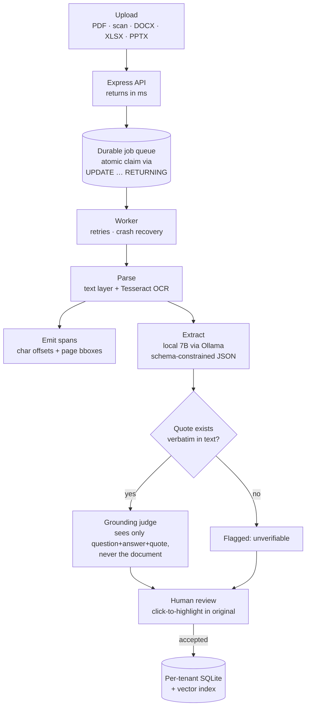

# Long Ngo

**Backend & Applied-AI Engineering**

- **Focus** — LLM systems that have to be *right*: retrieval grounding, hallucination detection, provenance, evaluation harnesses
- **Also** — multi-tenant backends, async job pipelines, TypeScript / Python / Node APIs
- **Education** — B.S. Computer Science, University of North Texas · Expected `‹GRAD TERM›`
- **Links** — [LinkedIn]([‹LINKEDIN-URL›](https://www.linkedin.com/in/long-thien-ngo/)) · [Resume](file:///C:/Users/Crack/Downloads/Jack_Ngo_Software_Engineer_Intern.pdf) · [jackngo2312@gmail.com](mailto:crackerjack2312@gmail.com)

`Python` · `TypeScript` · `Node.js` · `FastAPI` · `Express` · `React` · `LangGraph` · `SQLite` · `PostgreSQL` · `ChromaDB` · `Ollama` · `Docker`

---

## DotB EMS — Agentic RAG Support Assistant

> Deflects tier-1 support tickets for a Vietnamese education-management SaaS: answers "how do I…" product questions from ~250 pages of mixed Vietnamese/English help documentation, with citations — and hands off to a human instead of guessing.

Built a LangGraph agent over a hybrid retrieval pipeline — dense vector search and BM25 fused with Reciprocal Rank Fusion, then reranked by a local cross-encoder that is allowed to return *nothing*. Every answer passes a faithfulness gate scoring it against its own retrieved context before the user ever sees it; anything below threshold routes to a human rather than shipping a confident guess.

**Measured on a 39-question hand-reviewed golden set** (deliberately including out-of-scope questions where declining is the correct answer):

| Recall@10 | Faithfulness | Answer relevance | Answer correctness |
|:--:|:--:|:--:|:--:|
| **0.97** | **1.00** | 0.97 | 0.93 |

`Python` `LangGraph` `FastAPI` `Google Gemini` `ChromaDB` `BM25` `bge-reranker-v2-m3` `RAGAS-style eval`

[**Repo**](https://github.com/longngo2312/AgenticRagDotB) · [**Architecture & eval notes**](https://github.com/longngo2312/AgenticRagDotB#architecture)<!-- TODO: add · [**Live demo**](url) once deployed -->

---

## Document Extraction Platform

> Turns unstructured documents into reviewable structured data for teams whose documents can't leave their network — the model must cite a verbatim quote for every value it extracts, and a human accepts it before anything is indexed.

Built a multi-tenant TypeScript/Express platform where each customer's data lives in its own SQLite file, so cross-tenant leakage is removed by construction rather than defended against in query logic. Ingestion runs behind a durable job queue with single-statement atomic claims, bounded retries, and startup recovery for jobs orphaned by a crash — uploads return in milliseconds against a ~2-minute extraction. Extraction runs a quantized 7B model locally inside a 6 GB VRAM budget: **$0 per-document inference cost, and no document leaves the network.**

The part I'd point at first: every extracted value carries a verbatim source quote that the server verifies exists in the parsed text, resolved to character offsets and page coordinates so a reviewer clicks straight to the highlighted passage. A second isolated pass then judges whether the quote actually *supports* the answer — it receives only the question, answer, and quote, never the document, so it is structurally unable to justify a conclusion from uncited context.

`TypeScript` `Node.js` `Express 5` `SQLite (WAL)` `Ollama` `Qwen2.5-7B` `Tesseract OCR` `pdf.js` `React 19` `MUI` `Zustand`

[**Repo**](https://github.com/longngo2312/LongMentorshipSummer2026CPI/tree/main/DocumentExtraction) · [**Design docs**](https://github.com/longngo2312/LongMentorshipSummer2026CPI/tree/main/DocumentExtraction/docs)<!-- TODO: add · [**Live demo**](url) -->

---

## MoodMeal

> Helps people with food-triggered symptoms find the pattern their doctor asks about — log meals and symptoms on a calendar, then export the whole history as a PDF to bring to an appointment.

<!-- Record a 5-10s ScreenToGif clip: log a meal → log a symptom → calendar view → export PDF.
     Save it to assets/moodmeal-demo.gif, then delete these two comment lines to un-hide the image. -->
<!-- 

 -->

Cross-platform React Native app on Expo with Supabase for auth, Postgres, and row-level-secured storage of medical history. Meal and symptom entries share a calendar timeline so correlations are visible at a glance, and the whole log exports to a clinician-readable PDF.

`React Native` `Expo` `TypeScript` `Supabase` `PostgreSQL` `React Navigation` `React Native Paper`

[**Repo**](https://github.com/longngo2312/MoodMeal)<!-- TODO: add · [**TestFlight / Expo Go link**](url) -->

---

## Also

| Project | What it is | Stack |
|---|---|---|
| [YouTube Trending VN](https://github.com/longngo2312/YoutubeTrendingVN) | Trending-video dashboard for Vietnam; server-side caching keeps it inside the YouTube API's 10k unit/day free quota and off the client's key | React · Express · MongoDB |
| [Syllabus Scheduler](https://github.com/longngo2312/SyllabusScheduler) | Parses a course syllabus into a semester calendar of assignments and exams | React · Vite |
| [Backend API Sandbox](https://github.com/longngo2312/Backend-API-Sandbox) | REST API practice ground — routing, validation, MongoDB modeling | Node.js · Express · MongoDB |

---

Currently looking for **`‹TERM›` SWE internships** — backend, applied AI/ML infrastructure.
